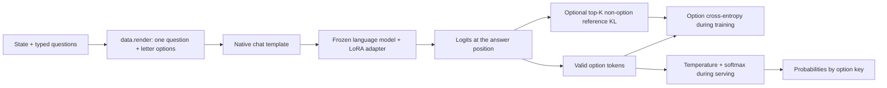

# Jev-alpha

Typed decision probabilities through [ms-swift](https://github.com/modelscope/ms-swift) plugins.
The model reads a **state** and typed **questions**. It returns probabilities without generating answer text.

- **noul:** return the probability of yes.
- **choice:** return a distribution over named options.
- **score:** return a distribution over ordered numeric levels.

This implementation uses one forward pass per question. Each pass repeats the state.
Shared-state computation, a pointer head, and reinforcement learning are not implemented.
The [architecture reference](https://archerhume.com/posts/jevs-architecture-unmasked) motivates this design; this repository does not reproduce Jev's internal implementation.

## Architecture



LoRA trains small adapter matrices while the base weights stay fixed.
The supervised loss applies cross-entropy to valid option-token logits at the position before the answer.
Only one answer token receives supervision. End-of-sequence tokens do not enter the loss.
Options shuffle each epoch. Training and serving call the same renderer.

The optional KL term compares the frozen base with the adapter model at that answer position.
The reference selects its top K vocabulary tokens after excluding the question's valid option tokens.
Each model applies a separate log-softmax over that same set.
The total loss is `option CE + weight * KL(reference || adapter)`.
This conditional KL does not constrain all vocabulary probabilities or all token positions.
The reference uses the same model with its adapter disabled; it does not require a second weight copy.

## Layout

```text
jev_alpha/
  data.py              # validation, option labels, shared renderer
  plugin.py            # ms-swift dataset, template, callback, and loss registration
  template.py          # native chat encoding, answer mask, epoch option shuffle
  loss.py              # option cross-entropy and combined loss
  regularization.py    # frozen-reference top-K KL
  predict.py           # probability inference
  calibrate.py         # held-out temperature fitting
  eval.py              # accuracy, Brier, calibration error, option-order checks
  datasets/            # small example data workflow and overlap checks
  plot_comparison.py   # documentation plot from attributed aggregate values
configs/               # reusable training and evaluation commands
scripts/               # example data preparation commands
tests/                 # core, plugin, and reference-loss tests
docs/assets/           # comparison SVG and source values
```

Data, checkpoints, reports, caches, local research workflows, and the ms-swift checkout stay outside Git.
The comparison SVG and its small aggregate-value file are included as requested documentation.
No trained weights or full experiment data are distributed.

## Setup

Use Python 3.12 and an NVIDIA GPU for the supplied training commands.
The tested environment uses PyTorch 2.8.0, Transformers 5.16.1, and an H200.
The default example model is `Qwen/Qwen3.5-0.8B-Base`.

```bash
git clone https://github.com/chenz53/Jev-alpha.git
cd Jev-alpha
uv venv .venv --python 3.12
source .venv/bin/activate
uv pip install -e '.[qwen]'
```

The package installs ms-swift directly from its original repository at commit `c2bcc23a1f1c428dc8be0ae509c31a532922453f`.
This is the approved development version `4.6.0.dev0`. There is no submodule or bundled framework source.
The Qwen extra includes its loader dependencies. Other models can need different loader dependencies.
The full local environment lock is excluded; this is not a complete environment lock.

## Input and output

```json
{
  "state": "The payment failed. The login works.",
  "questions": {
    "failed": {"type": "noul", "instructions": "Did the payment fail?", "criteria": {}},
    "route": {"type": "choice", "instructions": "Which team handles the problem?", "criteria": {"payments": "Payment failures", "account": "Login access"}},
    "severity": {"type": "score", "instructions": "Rate the problem using these levels.", "criteria": {"0": "No failure", "1": "Payment failure only", "2": "Payment and login failure"}}
  }
}
```

Each question needs 2 to 26 options. Empty `noul` criteria use `no` and `yes`.
Score keys must be distinct finite numbers. The tokenizer must encode A through Z as distinct single tokens.
Training records also need `id`, `dataset`, `split`, and a `target` option key for each question.
The target is an option key, not its shuffled letter. Targets and question IDs stay outside the prompt.

The renderer puts the state, question, type, and letter-labelled options in one user message.
The native chat template formats that message with thinking disabled.
Model inputs are token IDs and an attention mask. Training adds an answer-token label and the valid option count.
Serving returns a JSON object such as this illustrative output:

```json
{"failed": 0.98, "route": {"payments": 0.97, "account": 0.03}, "severity": {"0": 0.01, "1": 0.95, "2": 0.04}}
```

## Example training and evaluation

```bash
bash configs/build_data.sh
bash configs/train.sh
# Optional CE + KL run with a new output directory:
JEV_KL_TOP_K=64 JEV_KL_WEIGHT=0.1 bash configs/train.sh \
  --loss_type jev_options_kl --lora_dropout 0 --output_dir runs/boolq-kl
```

The example uses BoolQ training data and validation calibration data, plus 18 fixed synthetic test questions.
It checks the implementation. It does not reproduce the full Gemma experiment below.
Preparation removes exact and near state matches with held-out data. Whole test datasets remain separate in this example.
See [DATA.md](DATA.md) for source terms and the limits of these checks.
For a shorter integration run, use `bash configs/pilot.sh` after building the data.

```bash
CHECKPOINT=runs/boolq/<run>/checkpoint-<step> bash configs/evaluate.sh
python -m jev_alpha.predict --model Qwen/Qwen3.5-0.8B-Base \
  --adapter runs/boolq/<run>/checkpoint-<step> \
  --input requests.jsonl --output probabilities.jsonl
```

Replace the checkpoint placeholder with the path printed by training.
Calibration fits one temperature on separate labels and saves `temperature.json` with the adapter.
Serving loads that temperature when present; otherwise it uses one.
Evaluation reports accuracy, summed multiclass Brier score, and ten-bin expected calibration error before and after fitting.
It also checks a shuffled option order. Generated reports stay local under `reports/`.
Commands refuse to replace existing data and result files. Use new paths for another run.

Keep lazy tokenization, zero data workers, no packing, and full sequence logits for these loss hooks.
Inputs that exceed the context limit cause an error. The code does not truncate decision evidence.
The pin's `swift sft --help` exposes a preliminary parser. Read the full command flags with:

```bash
python -c 'import sys; from swift.pipelines import sft_main; sys.argv=["sft", "--help"]; sft_main()'
```

## Comparison with published Jev results


Our plotted model is **Gemma 4 26B A4B IT + option CE + KL 0.1**.
It trains on 8,400 questions for two epochs. Values average seeds 42, 43, and 44 on 100 final questions per dataset.
Seed 42 selects the KL weight; seeds 43 and 44 provide replication evidence.
The model revision is `4d7ae4984b7db7de8f8457170b3f1a419ee76d52`.

**This is a descriptive comparison, not a paired benchmark.**
The question samples, prompts, option construction, and evaluation partitions differ.
Our test questions come from training dataset families. Jev's training data is unknown.
Jev figures are third-party measurements published by Kev, not measurements from a new Jev run.
The radar uses a 0–100% scale. Its area is not an aggregate metric.

| Accuracy | Jev-alpha | Published Jev |
|---|---:|---:|
| BoolQ | 92.00% | 92.50% |
| QNLI | 94.33% | 92.50% |
| PAWS | 94.00% | 78.75% |
| MMLU | 83.00% | 90.00% |
| SciQ | 100.00% | 98.75% |
| HellaSwag | 90.33% | 89.33% |
| CLINC | 94.33% | 97.33% |
| DBpedia | 100.00% | 95.00% |
| SST-5 | 56.00% | 63.75% |
| Yelp | 62.00% | 66.25% |
| When2Call | 66.33% | 76.00% |

Jev sources use Kev commit `fe64b1274ea7f80d4095866df90666abb03e9cf6`:

- [Transfer-v4](https://github.com/jaredpalmer/kev/blob/fe64b1274ea7f80d4095866df90666abb03e9cf6/runs/jev-transfer-v4/report.json): MMLU, SciQ, QNLI, PAWS; 80 questions each.
- [Decision-v4](https://github.com/jaredpalmer/kev/blob/fe64b1274ea7f80d4095866df90666abb03e9cf6/runs/jev-decision-v4/report.json): BoolQ, DBpedia, SST-5, Yelp; 80 questions each.
- [Breadth-v1](https://github.com/jaredpalmer/kev/blob/fe64b1274ea7f80d4095866df90666abb03e9cf6/runs/breadth-v1-jev/report.json): CLINC and HellaSwag; 150 questions each.
- [Devtools-v1](https://github.com/jaredpalmer/kev/blob/fe64b1274ea7f80d4095866df90666abb03e9cf6/runs/jev-devtools-v1/report.json): When2Call; 150 questions.

[Plot values and provenance](docs/assets/jev-comparison.json) include source hashes and individual seed values.
With Matplotlib available, regenerate the SVG with `python -m jev_alpha.plot_comparison`.
Raw experiment reports, data, and checkpoints remain local. The published example is a reusable architecture workflow.

## Checks

```bash
python -m unittest discover -s tests -v
ruff check .
ruff format --check .
```

The plugin tests load the Qwen tokenizer through ms-swift. They can download model metadata on the first run.
