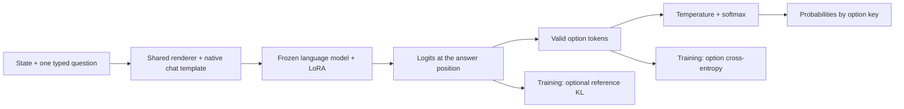

# Jev-alpha

**Build a useful decision model with thousands of examples and a single-GPU training budget.**

Jev-alpha explores the idea behind Jev: give a model a state and questions, then get probabilities that software can act on.
The goal is to reproduce that combination of **decision capability, fast inference, and low cost** with modest data and compute.

The **alpha** is deliberate. We start with a small, working training layer, measure what improves, and build toward efficient decision inference.
The first experiment establishes a capability baseline. Matching Jev's inference speed and cost remains a research goal.

**8,400 training questions · ~10 million trainable parameters · one H200 · eight runs in 20 hours 39 minutes**

This is an independent project inspired by Jev. It builds on [ms-swift](https://github.com/modelscope/ms-swift) without changing framework code.

## Decisions that software can use

Route a request. Check a condition. Assign an ordered level. Use the returned probabilities to choose an action or defer a decision.

| Question type | Example | Output |
|---|---|---|
| `noul` | Does the state establish a payment failure? | Probability of yes |
| `choice` | Which team handles this request? | Distribution over named options |
| `score` | What severity level applies? | Distribution over ordered levels |

All three types use the same record format:

```json
{
  "state": "The payment failed. The login works.",
  "questions": {
    "failed": {"type": "noul", "instructions": "Did the payment fail?", "criteria": {}},
    "route": {"type": "choice", "instructions": "Which team handles the problem?", "criteria": {"payments": "Payment failures", "account": "Login access"}},
    "severity": {"type": "score", "instructions": "Rate the problem using these levels.", "criteria": {"0": "No failure", "1": "Payment failure only", "2": "Payment and login failure"}}
  }
}
```

Illustrative output:

```json
{"failed": 0.98, "route": {"payments": 0.97, "account": 0.03}, "severity": {"0": 0.01, "1": 0.95, "2": 0.04}}
```

The model reads option probabilities directly from its output logits. It does not generate or parse answer text.
Each question accepts 2–26 options. Empty `noul` criteria use `no` and `yes`; `score` keys are numeric levels.
Training adds record fields `id`, `dataset`, and `split`, plus a `target` option key for each question.
Targets and question IDs stay outside the prompt.

## What the first experiment shows

We adapt **Gemma 4 26B A4B IT** with LoRA, which trains small added matrices while the base weights stay fixed.
The mixture contains 6,720 public questions and 1,680 directly authored questions, balanced across the three question types.
Each run uses two epochs. The full budget includes four screening runs, four replication runs, and evaluation.
The 26B model still needs its base weights in memory; the small adapter count is not the inference model size.

| Final measurement | Untouched base | Option CE | Option CE + KL 0.1 |
|---|---:|---:|---:|
| Accuracy | 74.22% | 80.30% | **80.48%** |
| Brier score ↓ | 0.486 | 0.289 | **0.287** |
| Independent-text KL ↓ | 0 | 0.803 | **0.690** |

Accuracy and Brier score give equal weight to the three question types. Trained values average three seeds.
Brier score measures probability error. KL measures a difference between probability distributions; the text measurement compares with the untouched base.
**Fine-tuning gains 6.26 accuracy points over the base. Adding KL reduces measured text drift by 14% against CE alone.**
The accuracy difference between the two trained methods is small and varies across seeds.
Lower text drift does not establish preservation of every base-model ability.
The final test has 1,100 questions from 11 dataset families used in training, with separate calibration data.
Seed 42 selects the KL weight; seeds 43 and 44 provide replication evidence.
When2Call remains a weakness: 66.33% after training versus 70% for the base.
Its public training subset lacks positive direct-answer and tool-call targets; authored questions supply examples of those actions.
See [DATA.md](DATA.md) for the data composition, source terms, and review limits.

## How this compares with Jev


Our column uses Gemma + option CE + KL 0.1, averaged across three seeds.
Jev figures are third-party measurements published by [Kev](https://github.com/jaredpalmer/kev).
The question samples, prompts, option construction, and partitions differ. Jev's training data is unknown.
**These results provide context; they do not establish a head-to-head ranking or parity with Jev.**
The radar uses a 0–100% scale. Its area is not an aggregate metric.

| Accuracy | Jev-alpha | Published Jev |
|---|---:|---:|
| BoolQ | 92.00% | 92.50% |
| QNLI | 94.33% | 92.50% |
| PAWS | 94.00% | 78.75% |
| MMLU | 83.00% | 90.00% |
| SciQ | 100.00% | 98.75% |
| HellaSwag | 90.33% | 89.33% |
| CLINC | 94.33% | 97.33% |
| DBpedia | 100.00% | 95.00% |
| SST-5 | 56.00% | 63.75% |
| Yelp | 62.00% | 66.25% |
| When2Call | 66.33% | 76.00% |

Our test uses 100 questions per dataset. Jev sources use Kev commit `fe64b1274ea7f80d4095866df90666abb03e9cf6`:

- [Transfer-v4](https://github.com/jaredpalmer/kev/blob/fe64b1274ea7f80d4095866df90666abb03e9cf6/runs/jev-transfer-v4/report.json): MMLU, SciQ, QNLI, PAWS; 80 questions each.
- [Decision-v4](https://github.com/jaredpalmer/kev/blob/fe64b1274ea7f80d4095866df90666abb03e9cf6/runs/jev-decision-v4/report.json): BoolQ, DBpedia, SST-5, Yelp; 80 questions each.
- [Breadth-v1](https://github.com/jaredpalmer/kev/blob/fe64b1274ea7f80d4095866df90666abb03e9cf6/runs/breadth-v1-jev/report.json): CLINC and HellaSwag; 150 questions each.
- [Devtools-v1](https://github.com/jaredpalmer/kev/blob/fe64b1274ea7f80d4095866df90666abb03e9cf6/runs/jev-devtools-v1/report.json): When2Call; 150 questions.

[Plot values and provenance](docs/assets/jev-comparison.json) include source hashes, the model revision, and individual seed values.
With Matplotlib available, regenerate the SVG with `python -m jev_alpha.plot_comparison`.

## How it works



The renderer gives each option a letter. The tokenizer must encode A–Z as distinct single tokens.
The model receives token IDs and an attention mask. Training adds a label for one answer token and the valid option count.
**Option cross-entropy (CE)** trains the distribution over valid option tokens at the position before that answer.
Options shuffle each epoch. Training and serving use the same renderer, with thinking disabled.
The optional **KL penalty** compares the adapter with the frozen base at that same position.
The reference selects its top 64 vocabulary tokens after excluding the question's valid option tokens.
Both models apply a separate log-softmax over that same set: `loss = option CE + weight × KL(reference || adapter)`.
The reference disables the adapter, so training does not load a second copy of the base weights.
This conditional penalty constrains the selected distribution, not the full vocabulary or every token position.

Calibration fits one temperature on separate labels and saves it with the adapter.
Evaluation checks accuracy, Brier score, ten-bin expected calibration error before and after fitting, and option-order changes.

## Scope and next steps

| Area | Current implementation | Research direction |
|---|---|---|
| Decision capability | Three question types, option CE, optional reference KL | Better action data and tests on unseen dataset families |
| Inference | Direct probability readout; one forward pass per question | Reuse state computation across questions |
| Speed and cost | BF16 and PyTorch attention in the measured experiment | Measure latency, throughput, and cost on matched workloads |
| Architecture | ms-swift plugins, frozen base, LoRA | Investigate a pointer head and question isolation |

Each question currently repeats the state. Avoiding answer generation does not by itself establish Jev-like latency or cost. Shared-state computation, a pointer head, and reinforcement learning are not implemented.
The [architecture reference](https://archerhume.com/posts/jevs-architecture-unmasked) guides the research; it is not a verified specification of Jev's internals.

This repository publishes the reusable architecture, tests, a small example workflow, and attributed comparison values.
Full experiment data, checkpoints, raw reports, and dated research workflows remain local and are not distributed.
The example below checks the implementation; it does not reproduce the full Gemma experiment.

## Get started

Use Python 3.12 and an NVIDIA GPU. The tested environment uses PyTorch 2.8.0, Transformers 5.16.1, and an H200.
The default example uses **Qwen3.5-0.8B-Base**, which is separate from the larger Gemma model used for the reported experiment.

```bash
git clone https://github.com/chenz53/Jev-alpha.git
cd Jev-alpha
uv venv .venv --python 3.12
source .venv/bin/activate
uv pip install -e '.[qwen]'
bash configs/build_data.sh
bash configs/train.sh
```

ms-swift installs from its original repository at commit `c2bcc23a1f1c428dc8be0ae509c31a532922453f` (`4.6.0.dev0`).
There is no framework fork or submodule. The Qwen extra supplies its loader dependencies; the project does not include a full environment lock.
The example uses BoolQ training and calibration data, plus 18 fixed synthetic test questions.
Preparation removes exact and near state matches with held-out data. For a short integration run, use `bash configs/pilot.sh`.

```bash
# Train with the optional reference penalty.
JEV_KL_TOP_K=64 JEV_KL_WEIGHT=0.1 bash configs/train.sh \
  --loss_type jev_options_kl --lora_dropout 0 --output_dir runs/boolq-kl
# Replace the checkpoint placeholder with the path printed by training.
CHECKPOINT=runs/boolq/<run>/checkpoint-<step> bash configs/evaluate.sh
python -m jev_alpha.predict --model Qwen/Qwen3.5-0.8B-Base \
  --adapter runs/boolq/<run>/checkpoint-<step> \
  --input requests.jsonl --output probabilities.jsonl
```

Save input records as JSON Lines: one JSON object per line. Serving loads the adapter's fitted temperature when present; otherwise it uses one.
Keep lazy tokenization, zero data workers, no packing, and full sequence logits for these loss hooks.
Inputs beyond the context limit cause an error. Commands refuse to replace existing data and result files.
The pin's full training flags are available through `python -c 'import sys; from swift.pipelines import sft_main; sys.argv=["sft", "--help"]; sft_main()'`.

## Code and checks

Core modules in `jev_alpha/` handle rendering, templates, losses, prediction, calibration, and evaluation.
`jev_alpha/datasets/` holds the example data workflow. `configs/` contains run scripts; `tests/` covers the core and framework hooks.
Data, checkpoints, reports, caches, and the optional local ms-swift checkout stay outside Git.

```bash
python -m unittest discover -s tests -v
ruff check .
ruff format --check .
```

Plugin tests load the Qwen tokenizer through ms-swift and can download metadata on the first run.
