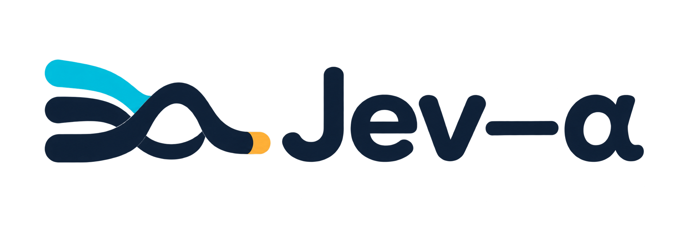
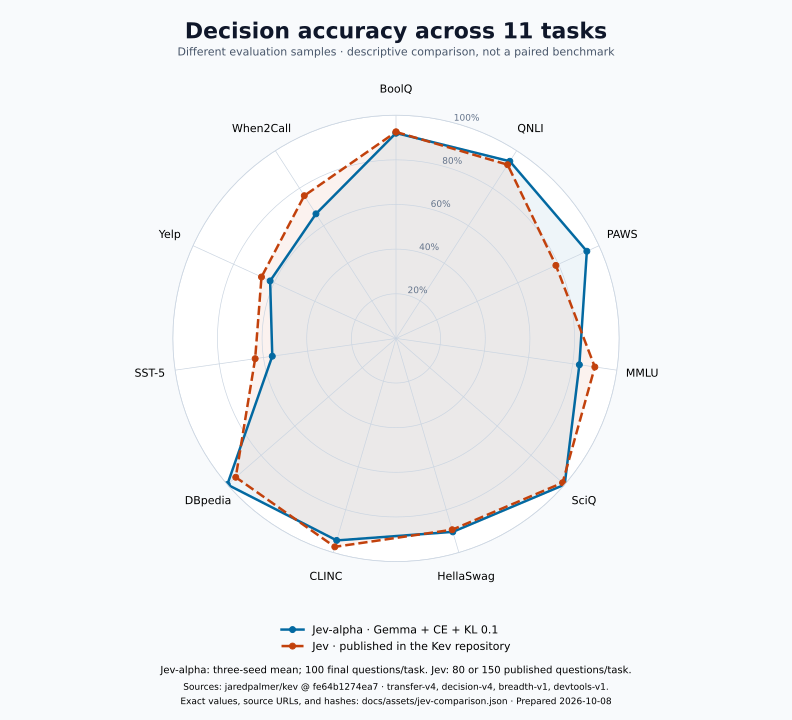
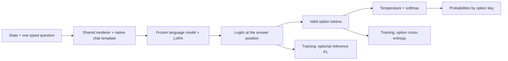

<h1 align="center"></h1>

[Decisions](#decisions-that-software-can-use) · [Results](#what-the-first-experiment-shows) · [Jev comparison](#how-this-compares-with-jev) · [Architecture](#how-it-works) · [Roadmap](#scope-and-next-steps) · [Quickstart](#get-started) · [Development](#code-and-checks) · [Model weights](https://huggingface.co/chenz53/Jev-alpha-26B-A4B)

**Build a useful decision model with thousands of examples and a single-GPU training budget.**

Jev-alpha explores the idea behind Jev: give a model a state and questions, then get probabilities that software can act on.
The goal is to reproduce that combination of **decision capability, fast inference, and low cost** with modest data and compute.

The **alpha** is deliberate. We start with a small, working training layer, measure what improves, and build toward efficient decision inference. The first experiment establishes a capability baseline. Matching Jev's inference speed and cost remains a research goal.

**8,400 training questions · ~10 million trainable parameters · one H200 · eight runs in 20 hours 39 minutes**

This is an independent project inspired by Jev. It builds on [ms-swift](https://github.com/modelscope/ms-swift) without changing framework code.

## Decisions that software can use

Route a request. Check a condition. Assign an ordered level. Use the returned probabilities to choose an action or defer a decision.

| Question type | Example | Output |
|---|---|---|
| `noul` | Does the state establish a payment failure? | Probability of yes |
| `choice` | Which team handles this request? | Distribution over named options |
| `score` | What severity level applies? | Distribution over ordered levels |

All three types use the same record format:

```json
{
  "state": "The payment failed. The login works.",
  "questions": {
    "failed": {"type": "noul", "instructions": "Did the payment fail?", "criteria": {}},
    "route": {"type": "choice", "instructions": "Which team handles the problem?", "criteria": {"payments": "Payment failures", "account": "Login access"}},
    "severity": {"type": "score", "instructions": "Rate the problem using these levels.", "criteria": {"0": "No failure", "1": "Payment failure only", "2": "Payment and login failure"}}
  }
}
```

Illustrative output:

```json
{"failed": 0.98, "route": {"payments": 0.97, "account": 0.03}, "severity": {"0": 0.01, "1": 0.95, "2": 0.04}}
```

The model reads option probabilities directly from its output logits. It does not generate or parse answer text.
Each question accepts 2–26 options. Empty `noul` criteria use `no` and `yes`; `score` keys are numeric levels.
Training adds record fields `id`, `dataset`, and `split`, plus a `target` option key for each question.
Targets and question IDs stay outside the prompt.

## What the first experiment shows

We adapt **Gemma 4 26B A4B IT** with LoRA, which trains small added matrices while the base weights stay fixed.
The mixture contains 6,720 public questions and 1,680 directly authored questions, balanced across the three question types.
Each run uses two epochs. The full budget includes four screening runs, four replication runs, and evaluation.
The 26B model still needs its base weights in memory; the small adapter count is not the inference model size.

| Final measurement | Untouched base | Option CE | Option CE + KL 0.1 |
|---|---:|---:|---:|
| Accuracy | 74.22% | 80.30% | **80.48%** |
| Brier score ↓ | 0.486 | 0.289 | **0.287** |
| Independent-text KL ↓ | 0 | 0.803 | **0.690** |

Accuracy and Brier score give equal weight to the three question types. Trained values average three seeds.
Brier score measures probability error. KL measures a difference between probability distributions; the text measurement compares with the untouched base.
**Fine-tuning gains 6.26 accuracy points over the base. Adding KL reduces measured text drift by 14% against CE alone.**
The accuracy difference between the two trained methods is small and varies across seeds.
Lower text drift does not establish preservation of every base-model ability.
The final test has 1,100 questions from 11 dataset families used in training, with separate calibration data.
Seed 42 selects the KL weight; seeds 43 and 44 provide replication evidence.
When2Call remains a weakness: 66.33% after training versus 70% for the base.
Its public training subset lacks positive direct-answer and tool-call targets; authored questions supply examples of those actions.
See [DATA.md](DATA.md) for the data composition, source terms, and review limits.

## How this compares with Jev



Our column uses Gemma + option CE + KL 0.1, averaged across three seeds.
Jev figures are third-party measurements published by [Kev](https://github.com/jaredpalmer/kev).
The question samples, prompts, option construction, and partitions differ. Jev's training data is unknown.
**These results provide context; they do not establish a head-to-head ranking or parity with Jev.**
The radar uses a 0–100% scale. Its area is not an aggregate metric.

See the [per-dataset accuracy table and pinned Jev sources](docs/comparison.md) for all 11 tasks and sample counts.

[Plot values and provenance](docs/assets/jev-comparison.json) include source hashes, the model revision, and individual seed values.

## How it works



The renderer assigns one letter token per option. Training and serving use the same native chat template, with thinking disabled. For question $i$, let $x_i$ be the rendered state and question, $O_i$ its valid option tokens, and $y_i\in O_i$ its target. Let $z_{\theta,i}(v)$ and $z_{0,i}(v)$ be the adapter and frozen-base logits for vocabulary token $v$, immediately before the answer.

**1. Learn the decision with option cross-entropy.** Normalize only over the valid options:

$$
p_{\theta,i}(v)=\frac{\exp z_{\theta,i}(v)}{\sum_{u\in O_i}\exp z_{\theta,i}(u)},\qquad \ell_{\mathrm{CE},i}=-\log p_{\theta,i}(y_i).
$$

This trains the required decision directly. Prompt tokens and end-of-sequence tokens receive no supervision. Options shuffle each epoch to reduce dependence on letter position. All three question types use this same categorical objective.

**2. Limit drift with conditional reference KL.** Let $V$ be the vocabulary. Select the base model's top $K$ non-option tokens:

$$
S_i=\operatorname{TopK}_{v\in V\setminus O_i}z_{0,i}(v),\qquad
\log q_{a,i}(v)=z_{a,i}(v)-\log\sum_{u\in S_i}\exp z_{a,i}(u),\quad a\in\{0,\theta\},\ v\in S_i.
$$

Both models use the same reference-selected set and separate log-softmax normalizations. The reference has no gradient and uses the disabled adapter.
Excluding valid option tokens lets CE train the decision while KL discourages changes to the base model's relative non-option preferences.

$$
\ell_{\mathrm{KL},i}=\sum_{v\in S_i}q_{0,i}(v)\log\frac{q_{0,i}(v)}{q_{\theta,i}(v)},\qquad
\mathcal{L}=\frac{1}{N}\sum_{i=1}^{N}\left(\ell_{\mathrm{CE},i}+\lambda\ell_{\mathrm{KL},i}\right).
$$

$N$ counts questions in the effective batch, including gradient accumulation. Each question supplies exactly one supervised answer token.
The released model uses **$K=64$ and $\lambda=0.1$**; $\lambda=0$ gives the CE baseline. Both training normalizations use temperature one.
The reference shares the frozen base weights, so it requires an extra forward pass but no second weight copy. This conditional KL constrains neither probability mass outside $S_i$ nor its total mass in the full vocabulary. It does not cover other token positions. It therefore reduces a measured form of drift; it does not guarantee preservation of all base-model abilities.

Calibration separately fits one temperature on held-out labels after training. Brier score is an evaluation metric, not a training objective here.
See [the CE implementation](jev_alpha/loss.py) and [the reference KL implementation](jev_alpha/regularization.py) for the exact masking and reductions.

## Scope and next steps

| Area | Current implementation | Research direction |
|---|---|---|
| Decision capability | Three question types, option CE, optional reference KL | Better action data and tests on unseen dataset families |
| Inference | Direct probability readout; one forward pass per question | Reuse state computation across questions |
| Speed and cost | BF16 and PyTorch attention in the measured experiment | Measure latency, throughput, and cost on matched workloads |
| Architecture | ms-swift plugins, frozen base, LoRA | Investigate a pointer head and question isolation |

Each question currently repeats the state. Avoiding answer generation does not by itself establish Jev-like latency or cost. Shared-state computation, a pointer head, and reinforcement learning are not implemented.
The [architecture reference](https://archerhume.com/posts/jevs-architecture-unmasked) guides the research; it is not a verified specification of Jev's internals.

This repository publishes the reusable architecture, tests, a small example workflow, and attributed comparison values.
Full experiment data, adapter checkpoints, raw reports, and dated research workflows remain local. The merged model is available on Hugging Face.

## Get started

Download **[chenz53/Jev-alpha-26B-A4B on Hugging Face](https://huggingface.co/chenz53/Jev-alpha-26B-A4B)**.
It contains 51.6 GB of standalone BF16 weights, the tokenizer, and a fitted temperature. No LoRA adapter is required.
This is the merged seed-42 checkpoint. Its measured accuracy is **79.50%**, distinct from the three-seed averages above.

Use Python 3.12 and enough GPU memory for the weights plus inference. The tested setup uses an H200, PyTorch 2.8.0, and Transformers 5.16.1.

```bash
git clone https://github.com/chenz53/Jev-alpha.git
cd Jev-alpha
uv venv .venv --python 3.12
source .venv/bin/activate
uv pip install -e .
```

The package installs the pinned upstream ms-swift dependency. Then run this example:

```python
import json
import torch
from huggingface_hub import hf_hub_download
from transformers import AutoProcessor, Gemma4ForConditionalGeneration
from jev_alpha.predict import predict

repo = "chenz53/Jev-alpha-26B-A4B"
model = Gemma4ForConditionalGeneration.from_pretrained(
    repo, dtype=torch.bfloat16, device_map="auto", attn_implementation="sdpa"
).eval()
model.set_experts_implementation("grouped_mm")
tokenizer = AutoProcessor.from_pretrained(repo).tokenizer
with open(hf_hub_download(repo, "temperature.json")) as stream:
    temperature = json.load(stream)["temperature"]
record = {"state": "The payment failed. The login works.", "questions": {
    "route": {"type": "choice", "instructions": "Which team handles the problem?",
              "criteria": {"payments": "Payment failures", "account": "Login access"}}
}}
print(predict(model, tokenizer, record, temperature=temperature))
```

The result maps `route` to probabilities for `payments` and `account`; it does not generate answer text.
Use the same `record` format for the `noul` and `score` questions shown above.
The example uses the release's measured expert backend and calibration. Different precision or backends can change probabilities.
See the [training guide](docs/training.md) to prepare data, train adapters, and evaluate a small Qwen baseline.

## Code and checks

Core modules in `jev_alpha/` handle rendering, templates, losses, prediction, calibration, and evaluation.
`configs/` contains run scripts; `tests/` covers the core and framework hooks.
See the [development checks](docs/training.md#code-and-checks) for test and formatting commands.
Data, checkpoints, reports, caches, and the optional local ms-swift checkout stay outside Git.
